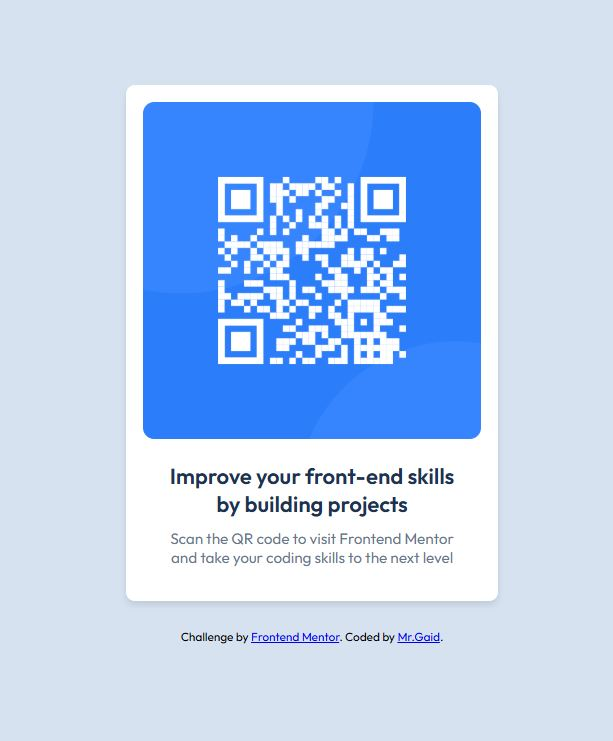

# Frontend Mentor - QR code component solution

This is a solution to the [QR code component challenge on Frontend Mentor](https://www.frontendmentor.io/challenges/qr-code-component-iux_sIO_H). Frontend Mentor challenges help you improve your coding skills by building realistic projects. 

## Table of contents

- [Overview](#overview)
  - [Screenshot](#screenshot)
  - [Links](#links)
- [My process](#my-process)
  - [Built with](#built-with)
  - [What I learned](#what-i-learned)
  - [Continued development](#continued-development)
  - [Useful resources](#useful-resources)

## Overview

### Screenshot

### Links

- Solution URL: [Add solution URL here](https://github.com/MR-Gaid/qr-code-challenge.git)
- Live Site URL: [Add live site URL here](https://mr-gaid.github.io/qr-code-challenge/)

## My process
This project is a completed QR Code Component challenge, showcasing responsive web design techniques and best practices.
### Built with

- Semantic HTML5 markup
- CSS custom properties
- Flexbox
- Mobile-first workflow

### What I learned

Through this project, I improved my understanding of CSS Flexbox, particularly how to structure and align elements efficiently. Additionally, I learned how to make an image fit perfectly inside a container, maintaining its full width while ensuring proper responsiveness. These skills have further strengthened my ability to build clean, responsive designs.

### Continued development

I aim to continue enhancing my expertise in Flexbox, focusing on mastering advanced layout techniques and exploring its use in more complex, responsive designs

### Useful resources

- [CSS-Tricks: A Complete Guide to Flexbox] – This resource was invaluable in understanding the nuances of Flexbox.
- [MDN Web Docs]: Responsive Images – Helped me understand how to work with images in a responsive design context.

